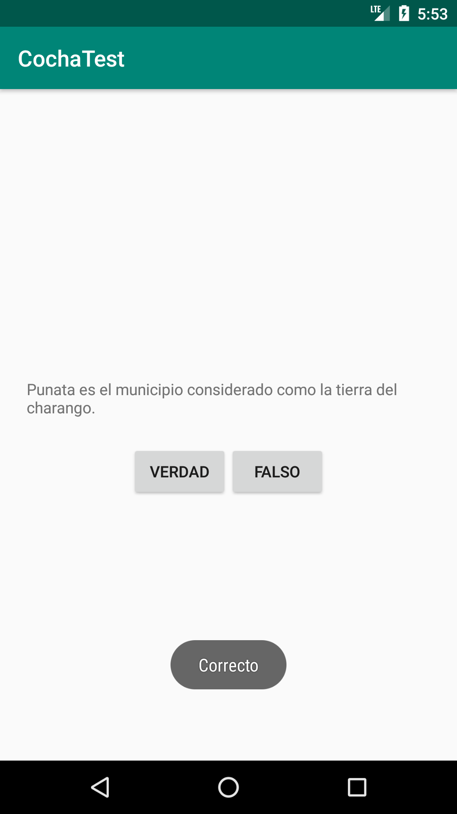
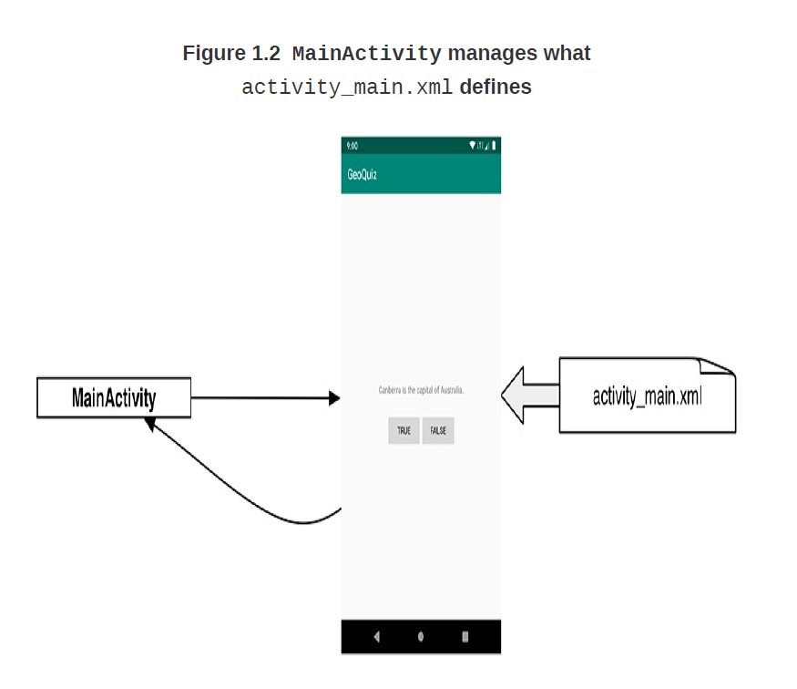
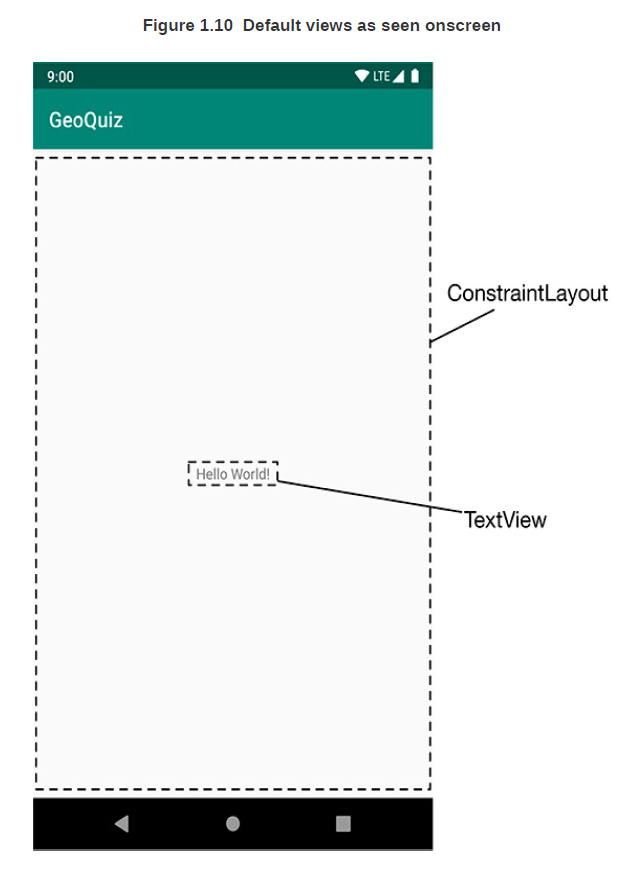
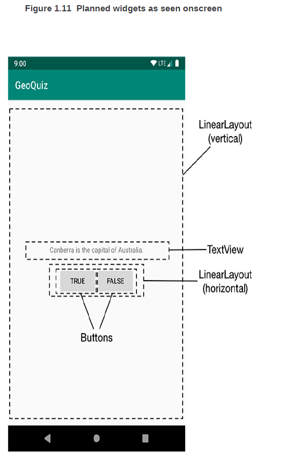
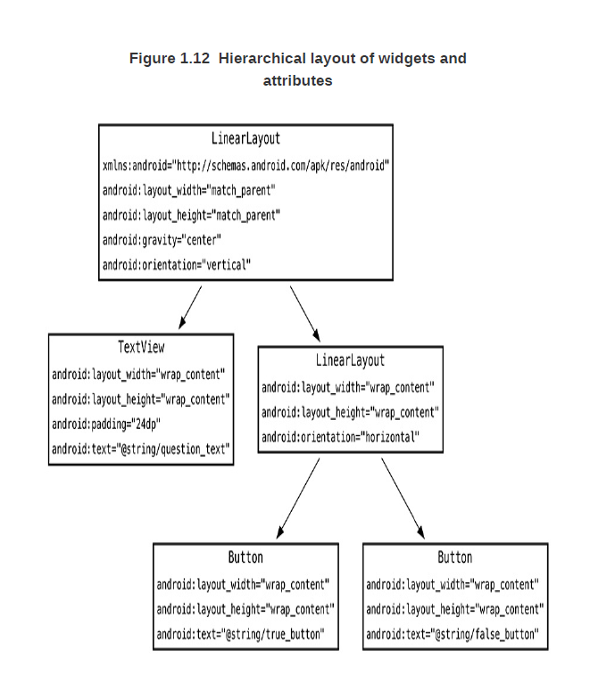
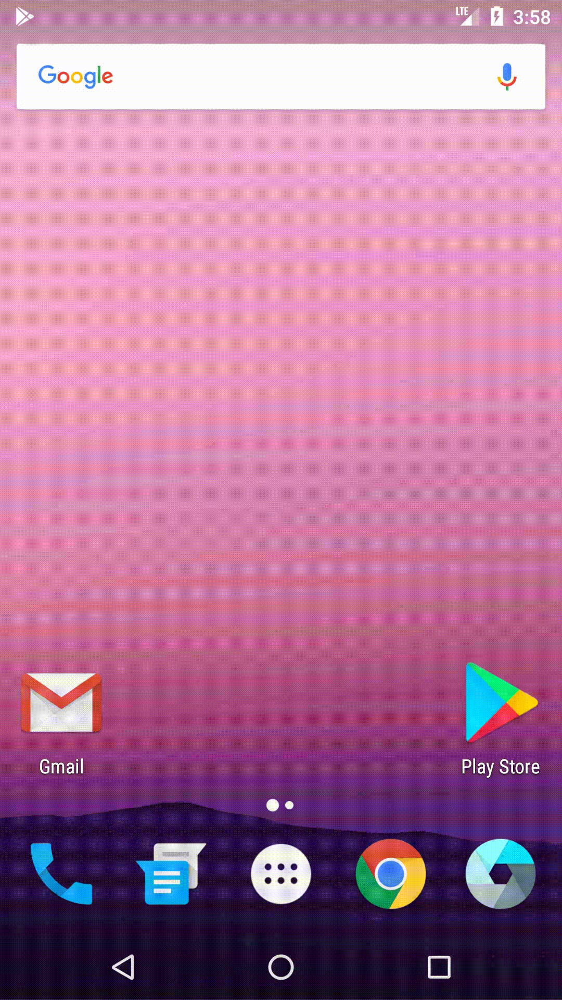

## Primera APP

## cochaTEST

<div class="column-left">

- APP que hace una serie de preguntas sobre la ciudad de cochabamba.
- APP basica que consiste en una **Activity** y un **Layout**
  
</div>
<div class="column-right">

{width=300px}

</div>

## Navegando en Android Studio

{width=1000px height=600px}


## Relacion entre un MainActivity.kt y un MainActivity.xml




## activity layout por defecto

<div class="column-left">


    
```

<androidx.constraintlayout.widget.ConstraintLayout  
      xmlns:android="http://schemas.android.com/apk/res/android"  
      xmlns:tools="http://schemas.android.com/tools"  
      xmlns:app="http://schemas.android.com/apk/res-auto"  
      android:layout_width="match_parent"  
      android:layout_height="match_parent"  
      tools:context=".MainActivity">  
      
    <TextView  
      android:layout_width="wrap_content"  
      android:layout_height="wrap_content"  
      android:text="Hello World!"  
      app:layout_constraintBottom_toBottomOf="parent"  
      app:layout_constraintLeft_toLeftOf="parent"  
      app:layout_constraintRight_toRightOf="parent"  
      app:layout_constraintTop_toTopOf="parent"/>  
      
    </androidx.constraintlayout.widget.ConstraintLayout>

```
</div>
<div class="column-right">
    
- **consideraciones:**
  - por defecto, se definen **2 vistas (VIEWs)**
  - las vistas (VIEW) **componen** un *UI*.
  - todo lo que ves en una pantalla, es una VISTA**(View)**
  - las vistas con el que el usuario interactua, son llamados **WIDGETs**.

</div>

## VISTA DEL UI



# Haciendo cambios
## modificando el layout

{height=650px}

## definiendo los widgets en xml:

    <LinearLayout  
      xmlns:android="http://schemas.android.com/apk/res/android"  
      android:layout_width="match_parent"  
      android:layout_height="match_parent"  
      android:gravity="center"  
      android:orientation="vertical">  
        <TextView  
      android:layout_width="wrap_content"  
      android:layout_height="wrap_content"  
      android:padding="24dp"  
      android:text="@string/pregunta_text" />  
        <LinearLayout  
      android:layout_width="wrap_content"  
      android:layout_height="wrap_content"  
      android:orientation="horizontal">  
            <Button  
      android:layout_width="wrap_content"  
      android:layout_height="wrap_content"  
      android:text="@string/verdad_button" />  
            <Button  
      android:layout_width="wrap_content"  
      android:layout_height="wrap_content"  
      android:text="@string/falso_button" />  
        </LinearLayout>  
      
    </LinearLayout>
    
- cada elemento (VIEW) tiene un grupo de **atributos XML**.


# jerarquia de las vistas (VIEW)
## cochaTEST jerarquia

<div class="column-left">

- El elemento **RAIZ(root)** es el **linearLayout**.
- **linearLayout** hereda de **ViewGroup**, que hereda de **View**.
- clases hermanas de linearlayout:
  - **FrameLayout**
  - **ConstraintLayout**
- Se dice que un *View* es hijo de un **ViewGroup**, si este ultimo lo contiene.
  
</div>
<div class="column-right">

{height=650px}

</div>

# atributos de un widget
## atributos width y height

- son atributos que son necesarios para casi todos los **WIDGETs**.
- **match_parent**:
  - indica que el widget sera tan grande como su padre.
- **wrap_content**:
  - indica que el widget sera tan grande como su contenido.
- **android:orientation**:
  - indica que direccion tomaran sus elementos hijos.
- **android:text**:
  - le dice al **widget** que mostrara en pantalla.
- **NOTA:** los recursos **STRING** son ubicados en otro archivo, y son llamados bajo la notacion: **@string/syntax**.

## creando recursos "string"

  
    <string name="verdad_button">Verdad</string>  
    <string name="falso_button">Falso</string>  
    <string name="correcto_toast">Correcto</string>  
    <string name="incorrecto_toast">Incorrecto</string>

- cada proyecto incluye por defecto un archivo para almacenar valores **STRINGS**:
  - **/res/values/strings.xml**
  
  
## de xml a objetos de tipo vista


- aclaremos: un **layout** es un **recurso**, una pieza de la APP que **no es codigo**.
- para acceder a un **recurso**, hay que invocar su **ID** de recurso.
- Las APP en android estan basadas en eventos, para darles funcionalidad se les añade un escucha (LISTENER).
- un objeto **TOAST** muestra un mensaje corto en la pantalla.

## declarando objetos y conectandolos:

    private lateinit var botonVerdad : Button  
    private lateinit var botonFalso : Button  
      
      
    override fun onCreate(savedInstanceState: Bundle?) {  
        super.onCreate(savedInstanceState)  
        setContentView(R.layout.activity_main)  
      
        botonVerdad = findViewById(R.id.verdad_button)  
        botonFalso = findViewById(R.id.falso_button)  
      
        botonVerdad.setOnClickListener {view : View ->  
      val muestraMensaje = Toast.makeText(this, R.string.correcto_toast, Toast.LENGTH_SHORT)  
            muestraMensaje.show()  
        }  
      
      botonFalso.setOnClickListener {view : View ->  
      
      val muestraMensaje = Toast.makeText(this, R.string.incorrecto_toast, Toast.LENGTH_SHORT)  
            muestraMensaje.show()  
        }  
    }

## motrando mensajes con: TOAST

  makeText(context: Context, resId: Int, duration: Int).
  
## desafio

<div class="column-left">

- el mensaje de TOAST me debe mostrar en la parte superior de la pantalla.

- para completar, fijarse la documentacion
[aqui](https://developer.android.com/reference/kotlin/android/widget/Toast#setgravity)
- usar la funcion **setGravity** de la clase **TOAST**.
  
</div>
<div class="column-right">

{width=300px}

</div>
